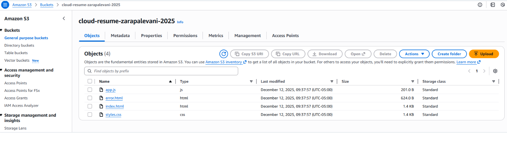
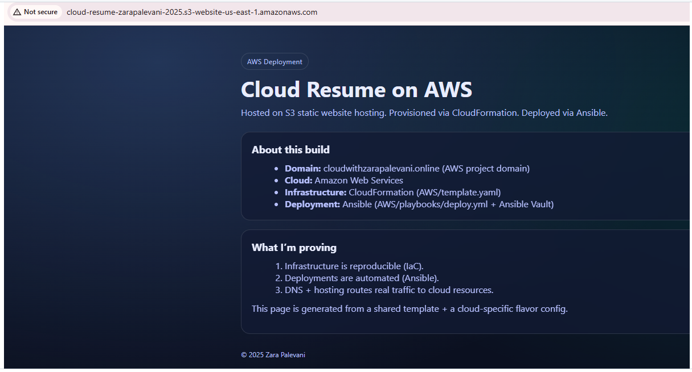
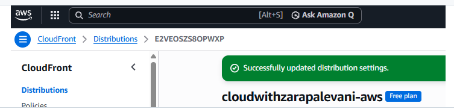
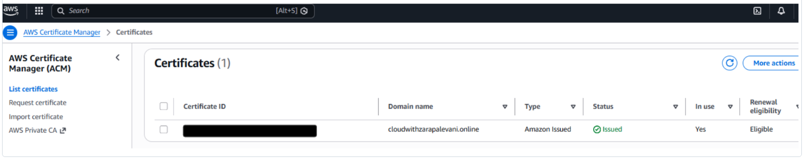
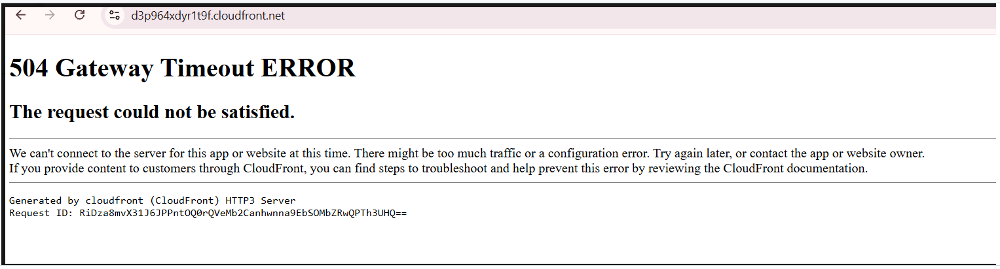
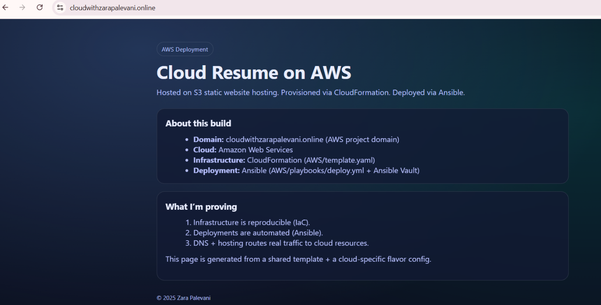
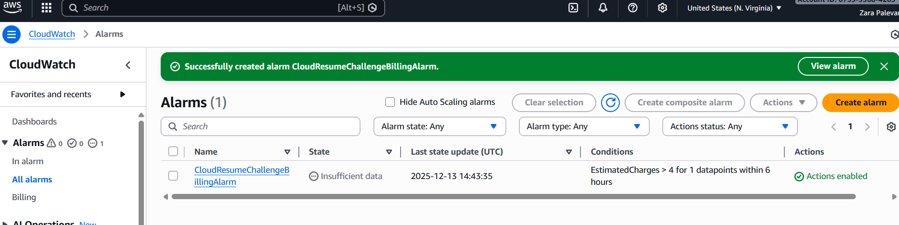
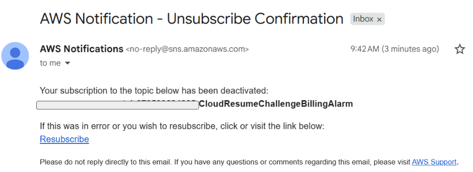

# Dec 11, 2025 (Frontend)

Purchased URL from namecheapa for my AWS project: cloudwithzarapalevani.online. I am aware that I could registere a domain via Route 53 but chose to do so via NameCheap. 

I delegated my domain cloudwithzarapalevani.online from NameCheap to AWS Route 53. This means Route 53 now controls all DNS for my domain instead of NameCheap. By updating the nameservers, I effectively told the internet: “If you need DNS answers for my domain, go to AWS.” This shift gives me full flexibility to route traffic to my cloud resources and manage all DNS records directly inside Route 53. A small but critical step in building a fully cloud-hosted resume stack.

Next, I work on having a one-command, fully reproducible way to create/update my AWS S3 front-end hosting infrastructure using CloudFormation, driven by Ansible, so later I can plug this into CI/CD.

Ansible is an open-source IT automation engine that simplifies complex IT tasks like configuration management, application deployment, and orchestration by describing your infrastructure in simple, declarative YAML files (called playbooks).

After delegating my domain to Route 53, I began building the automation foundation for my Cloud Resume Challenge. The goal is to deploy my front-end hosting infrastructure using CloudFormation, executed through Ansible, with everything version-controlled and reproducible using a single command.
Setting up my infrastructure-as-code workflow
I opened my repository in GitHub Codespaces so I could work inside a Linux environment (required for Ansible). My repository structure now includes an AWS folder that will contain:
```
AWS/
  template.yaml         # CloudFormation template
  playbooks/
      deploy.yml        # Ansible playbook to deploy CloudFormation
  vaults/
      prod.yml          # Encrypted secrets for Ansible Vault
  bin/
      deploy            # One-command deploy script
```
Installing Ansible in Codespaces
Inside Codespaces, I installed Ansible and the AWS collection required for CloudFormation deployments:

```
sudo apt update
sudo apt install -y ansible python3-boto3
ansible-galaxy collection install amazon.aws
```
I verified installation:
```
ansible --version
ansible-vault --version
```
Creating my CloudFormation template
I created a minimal CloudFormation template at AWS/template.yaml that defines an S3 bucket for my front-end:

```
AWSTemplateFormatVersion: '2010-09-09'
Description: Cloud Resume Challenge - S3 bucket for frontend hosting

Parameters:
  BucketName:
    Type: String

Resources:
  ResumeBucket:
    Type: AWS::S3::Bucket
    Properties:
      BucketName: !Ref BucketName
    DeletionPolicy: Retain
```
Creating the Ansible playbook
At AWS/playbooks/deploy.yml, I wrote the playbook that applies this CloudFormation stack:
```
---
- name: Deploy CloudFormation stack for Cloud Resume Challenge
  hosts: localhost
  connection: local
  gather_facts: false

  vars_files:
    - ../vaults/prod.yml

  environment:
    AWS_ACCESS_KEY_ID: "{{ aws_access_key_id }}"
    AWS_SECRET_ACCESS_KEY: "{{ aws_secret_access_key }}"
    AWS_DEFAULT_REGION: "{{ aws_region }}"

  tasks:
    - name: Ensure CloudFormation stack is present
      amazon.aws.cloudformation:
        stack_name: "{{ cfn_stack }}"
        state: present
        region: "{{ aws_region }}"
        template: "{{ playbook_dir }}/../template.yaml"
        template_parameters:
          BucketName: "{{ bucket_name }}"
        disable_rollback: false
        on_create_failure: ROLLBACK
        wait: true
```
Creating AWS credentials for automation
In AWS IAM, I created a machine user:
User: cloud-resume-challenge-machine

Permission: AdministratorAccess (temporary for the project)

Generated:

Access Key ID

Secret Access Key

Storing secrets in an Ansible Vault
I created the unencrypted file first:
```
cat > AWS/vaults/prod.yml
```

Contents:

```
cfn_stack: cloud-resume-challenge
aws_region: us-east-1

aws_access_key_id: <MY_ACCESS_KEY_ID>
aws_secret_access_key: <MY_SECRET_ACCESS_KEY>

bucket_name: cloud-resume-zarapalevani-2025
```

Then I encrypted it:

```
ansible-vault encrypt AWS/vaults/prod.yml
```
This replaced the file contents with AES256-encrypted vault text.
Creating the one-command deploy script
Under AWS/bin/deploy:
```
#!/usr/bin/env bash
set -euo pipefail

SCRIPT_DIR="$(cd "$(dirname "${BASH_SOURCE[0]}")" && pwd)"
PROJECT_ROOT="$(cd "${SCRIPT_DIR}/.." && pwd)"

cd "${PROJECT_ROOT}"

ansible-playbook --ask-vault-pass AWS/playbooks/deploy.yml "$@"
```
Made it executable:

```
chmod +x AWS/bin/deploy
```

Or via my one-command script:
```
./AWS/bin/deploy
```

This executed CloudFormation through Ansible, creating my S3 bucket inside AWS — the first real piece of my automated Cloud Resume Challenge infrastructure.

I iterated through multiple Ansible and YAML errors (bad playbook syntax, invalid vault YAML, unsupported CloudFormation module parameters, and missing boto3/botocore on the Codespaces Python interpreter). After fixing these one by one, I ran:
```
ansible-playbook --ask-vault-pass AWS/playbooks/deploy.yml
```
The playbook completed successfully with:
```
Stack CREATE complete
```
and CloudFormation now shows a stack named cloud-resume-challenge in CREATE_COMPLETE state, with an S3 bucket resource cloud-resume-zarapalevani-2025. My one-command infra deploy is officially working.


# Dec 12 (Frontend)

I proceeded to implement static website hosting on AWS S3 using a repeatable, automation-first approach that aligns with how I plan to deploy the same architecture across Azure and GCP.

Rather than building three separate frontends, I designed a shared frontend with cloud-specific “flavors.” The shared layer contains the core HTML, CSS, and JavaScript, while each cloud provider (AWS, Azure, GCP) has its own JSON configuration file to inject provider-specific text, tooling, and domain details at build time. This allows one codebase to support three cloud providers cleanly, without duplication.

I structured the repository to reflect this design:

- frontend/shared/ — common HTML, CSS, JS
- frontend/flavors/ — provider-specific JSON configs (aws.json, azure.json, gcp.json)
- frontend/dist/ — generated, deployable artifacts per provider
- scripts/ — build automation
- AWS/ — CloudFormation + Ansible infrastructure and deployment logic

To generate the AWS version of the site, I used a build script that:

1. Reads the shared frontend templates
2. Loads the AWS flavor configuration
3. Replaces placeholders with AWS-specific values
4. Outputs a fully static site under frontend/dist/aws/

This approach ensures the frontend is deterministic and reproducible, with no manual edits required per cloud.

On the infrastructure side, I extended my existing Ansible playbook to orchestrate the full AWS deployment workflow:

- Ensure the CloudFormation stack exists (idempotent)
- Build the AWS frontend flavor
- Upload the generated static site to the S3 bucket using aws s3 sync

The deployment was executed from GitHub Codespaces using:
```
ansible-playbook --ask-vault-pass AWS/playbooks/deploy.yml
```
The CloudFormation stack successfully created the S3 bucket, and the Ansible run confirmed the upload of the frontend assets. I verified that the bucket contained the expected files (index.html, error.html, styles.css, app.js) and that the S3 website endpoint correctly served the AWS version of my resume.

At this point:

- Infrastructure is defined as code (CloudFormation)
- Secrets are managed securely (Ansible Vault)
- Frontend builds are automated and provider-aware
- Deployment is repeatable with a single command

This establishes a solid foundation for the next steps: mapping my custom domain to the S3 website endpoint, adding HTTPS via CloudFront, and then replicating the same frontend-and-flavor pattern for Azure and GCP using their native services.
Files uploaded to S3 Bucket: 
This is how the first version of the website look like: 

With the static website successfully hosted on S3, the next step was to make it accessible through my custom domain with HTTPS. This required introducing CloudFront as a CDN layer in front of the S3 website and configuring DNS and TLS correctly.

I created a CloudFront distribution with my S3 static website endpoint set as the origin. CloudFront provides global edge caching, HTTPS termination, and acts as the public-facing entry point for my site. At this stage, the site was reachable via the CloudFront-generated domain name (*.cloudfront.net), confirming that the distribution was correctly serving the S3 content.

To connect my custom domain (cloudwithzarapalevani.online) to CloudFront, I added the domain as an Alternate Domain Name (CNAME) in the CloudFront distribution settings. I included both the root domain and the www subdomain to ensure consistent access patterns:
- cloudwithzarapalevani.online
- www.cloudwithzarapalevani.online

Because CloudFront requires HTTPS for custom domains, I requested a public TLS certificate using AWS Certificate Manager (ACM). I requested the certificate in the us-east-1 region (a strict requirement for CloudFront) and included the following domain names:
- cloudwithzarapalevani.online
- www.cloudwithzarapalevani.online
- *.cloudwithzarapalevani.online

I selected DNS validation, which allows AWS to verify domain ownership through Route 53 records rather than email approval. From the ACM console, I used the “Create records in Route 53” option, which automatically added the required CNAME validation records to my hosted zone. This step confirmed that Route 53 was correctly configured as the authoritative DNS provider for my domain.

Once the validation records were created, the certificate entered a “Pending validation” state. While waiting for validation and propagation, I returned to the CloudFront distribution and attached the ACM certificate to it. I also configured the security policy to TLS 1.2 (recommended) and set index.html as the default root object so requests to the root path would resolve correctly.

Next, I created Route 53 alias A records to route traffic from my domain to CloudFront. I created:
- An alias A record for cloudwithzarapalevani.online pointing to the CloudFront distribution
- An alias A record for www.cloudwithzarapalevani.online pointing to the same distribution

Using alias records instead of traditional CNAMEs allows Route 53 to support apex (root) domains and integrates natively with AWS services.

After creating the DNS records, Route 53 began propagating the changes globally. During this phase, the domain temporarily returned DNS errors (NXDOMAIN), which is expected behavior while DNS and certificate validation propagate across the internet.

At this point, all major components were in place:
- Route 53 controlling DNS
- S3 hosting the static frontend
- CloudFront serving the site globally
- ACM providing HTTPS certificates
- A custom domain mapped to the distribution

The remaining work is primarily waiting for propagation and certificate validation to complete, after which the site will be accessible securely at:
https://cloudwithzarapalevani.online
and
https://www.cloudwithzarapalevani.online

This completes the AWS end-to-end path from infrastructure-as-code to a production-grade, HTTPS-enabled static website. The same architectural pattern can now be reused for Azure and GCP, with only provider-specific infrastructure and DNS differences, while keeping the frontend codebase shared and consistent across clouds.

Screenshots:
- CloudFront distribution overview 

- ACM certificate pending → issued

- Final site loading over HTTPS


During DNS and CloudFront propagation, I temporarily encountered 504 Gateway Timeout errors when accessing both the CloudFront domain and my custom domain. This indicated that CloudFront was unable to reach the S3 origin at that moment — a common transient state while distributions deploy globally and origin configurations finalize.

I verified that the S3 static website endpoint itself was reachable directly and serving the expected content, confirming that the issue was not with the bucket or uploaded assets, but with CloudFront still deploying and stabilizing the origin connection.

I reviewed the CloudFront origin configuration to ensure it was pointing to the S3 static website endpoint (not the S3 REST API endpoint), and confirmed that the origin protocol policy was set to HTTP only, which is required for S3 website origins. No changes were needed at this stage — the configuration was correct.

After allowing additional time for CloudFront deployment and DNS propagation to complete, the 504 errors resolved on their own. The CloudFront distribution status transitioned to fully enabled, and both the CloudFront-generated domain and my custom domains began serving the site correctly.

At that point, my resume site was successfully live and accessible over HTTPS at:

- https://cloudwithzarapalevani.online
- https://www.cloudwithzarapalevani.online



This confirmed that the full request path was functioning as intended:

Route 53 → CloudFront → S3 static website
Reaching this state marked the completion of the AWS hosting portion of my Cloud Resume Challenge. I now have a globally distributed, HTTPS-secured static website backed by infrastructure as code, automation-first deployment, and a clean separation between shared frontend logic and cloud-specific implementations.

# Dec 13

## AWS Cost Control – CloudWatch Billing Alarm

Today I set up an AWS CloudWatch billing alarm to actively monitor my account spend and prevent unexpected charges. The alarm tracks the EstimatedCharges metric and triggers when costs exceed $4 within a 6-hour window. This gives me early visibility before hitting my $3–$5 learning budget and reinforces good cloud hygiene.

This step is important because cost monitoring is a real-world operational concern, not just a technical one. It ensures my Cloud Resume Challenge infrastructure stays lean, controlled, and production-ready while I continue experimenting with AWS services.



I also created a monthly AWS budget to formally cap and monitor my cloud spending while working through the Cloud Resume Challenge. The budget is configured as a recurring monthly budget, using a fixed budgeting method with a total limit of $5.00 USD.

The budget scope covers filtered AWS cost dimensions, excluding credits and refunds, which helps me track actual usage-based spend more accurately. This setup provides a proactive financial guardrail alongside my CloudWatch billing alarm, ensuring I maintain strict cost discipline while learning and deploying AWS resources.

This step reflects real-world cloud operations best practices—cost governance, visibility, and accountability—rather than treating cloud usage as “free experimentation.”
