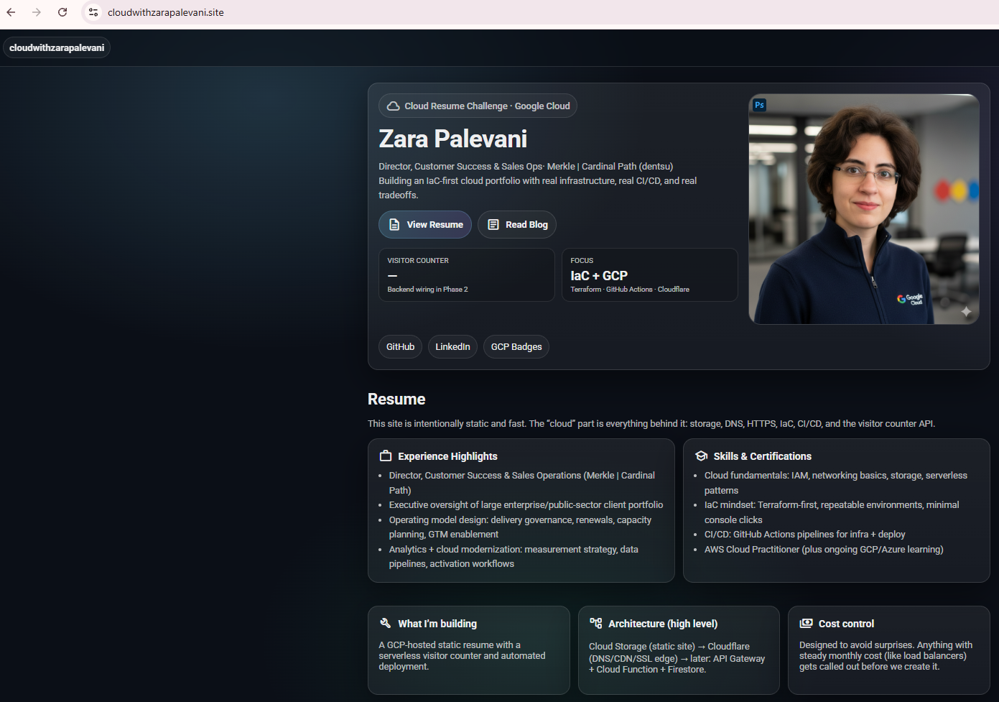

                     ┌─────────────────────────────────────────┐
                     │            HostGator DNS                │
                     │-----------------------------------------│
                     │  cloudwith.zarapalevani.com  (CNAME)    │
                     │  → c.storage.googleapis.com             │
                     └─────────────────────────────────────────┘
                                      │
                                      ▼
     ┌───────────────────────────────────────────────────────────────────┐
     │                  Google HTTPS Load Balancer                       │
     │───────────────────────────────────────────────────────────────────│
     │  • Global HTTP(S) entry point                                     │
     │  • Routing rules → backend bucket                                 │
     │  • HTTP → HTTPS redirect                                          │
     │                                                                   │
     │  SSL: Google-Managed Certificate (cloudwith-cert)                │
     └───────────────────────────────────────────────────────────────────┘
                                      │
                                      ▼
           ┌───────────────────────────────────────────────────────┐
           │     Google Compute Backend Bucket (cloudwith…)        │
           │───────────────────────────────────────────────────────│
           │ • Connects load balancer → Cloud Storage              │
           │ • CDN enabled                                         │
           └───────────────────────────────────────────────────────┘
                                      │
                                      ▼
      ┌────────────────────────────────────────────────────────────────────┐
      │      Google Cloud Storage Bucket (cloudwith.zarapalevani.com)     │
      │────────────────────────────────────────────────────────────────────│
      │  Public static file hosting for website:                           │
      │   • index.html                                                     │
      │   • blog.html                                                      │
      │   • resume.html                                                    │
      │   • 404.html                                                       │
      │   • images/Zara Palevani.jpg                                       │
      │                                                                    │
      │  IAM: allUsers → roles/storage.objectViewer                       │
      └────────────────────────────────────────────────────────────────────┘
                                      │
                                      ▼
               ┌────────────────────────────────────────────┐
               │         User Browser (Global)              │
               │--------------------------------------------│
               │ Loads website via CDN + HTTPS              │
               └────────────────────────────────────────────┘


---

# CloudWith Website Deployment - Full Technical Documentation (A → Z)

**Date:** Nov 23–24, 2025
**Author:** Zara Palevani

---

## 1. Project Overview

This document captures the full end-to-end process of deploying the CloudWith Zara static website using Google Cloud Platform, Terraform, Ansible, Cloud Storage, CDN, and HostGator DNS.
It reflects real-world enterprise infrastructure setup and secure authentication practices.

---

## 2. Repository Structure

```plaintext
cloud-resume-challenge/
│
├── GCP/
│   ├── main.tf
│   ├── terraform.tfstate
│   ├── terraform.tfvars
│   ├── playbooks/
│   │     └── deploy.yml
│   ├── vaults/
│   │     └── (empty)  ← secure approach, no JSON committed
│   └── site/
│         ├── index.html
│         ├── 404.html
│         ├── blog.html
│         ├── resume.html
│         └── images/
│               └── Zara Palevani.jpg
```

---

## 3. Domain + DNS Configuration (HostGator)

The domain registrar is HostGator, so DNS management happened there.

### CNAME Record (Final)

| Field     | Value                      |
| --------- | -------------------------- |
| Host      | `cloudwith`                |
| Type      | `CNAME`                    |
| Points to | `c.storage.googleapis.com` |
| TTL       | Default                    |

This makes the subdomain reachable globally.

---

## 4. Google Cloud Platform Setup

### 4.1 Cloud Storage Bucket

Created bucket:

```
cloudwith.zarapalevani.com
```

Configured as a static website with:

* `index.html`
* `404.html`

### 4.2 HTTPS Load Balancer

Configured manually:

* Global HTTPS load balancer
* HTTP → HTTPS redirect
* Routing rule → backend bucket
* CDN enabled
* Managed SSL certificate: `cloudwith-cert`

### 4.3 SSL Certificate

Life cycle observed:

```
FAILED_NOT_VISIBLE → PROVISIONING → ACTIVE
```

Activation required DNS propagation.

---

## 5. Installing Google Cloud SDK in GitHub Codespaces

Codespace is a clean Linux container, so I installed the CLI manually:

```bash
sudo apt-get update && sudo apt-get install -y curl apt-transport-https ca-certificates gnupg
curl -O https://dl.google.com/dl/cloudsdk/channels/rapid/downloads/google-cloud-cli-462.0.0-linux-x86_64.tar.gz
tar -xf google-cloud-cli-462.0.0-linux-x86_64.tar.gz
./google-cloud-sdk/install.sh
```

Then activated the PATH:

```bash
source google-cloud-sdk/path.bash.inc
```

---

## 6. Secure Authentication (No JSON Key)

Instead of using a service-account key, I authenticated using **ADC (Application Default Credentials)**:

```bash
gcloud auth login
gcloud auth application-default login
```

This created:

```
~/.config/gcloud/application_default_credentials.json
```

Terraform automatically uses that file.

---

## 7. Terraform Configuration (main.tf)

Below is the working IaC configuration:

```hcl
provider "google" {
  project = "cloud-resume-challenge-479115"
  region  = "us-east1"
}

resource "google_storage_bucket" "static-site" {
  name          = var.bucket_name
  location      = "us-east1"
  force_destroy = true

  uniform_bucket_level_access = true

  website {
    main_page_suffix = "index.html"
    not_found_page   = "404.html"
  }
}

resource "google_storage_bucket_iam_member" "public_read" {
  bucket = google_storage_bucket.static-site.name
  role   = "roles/storage.objectViewer"
  member = "allUsers"
}

resource "google_compute_backend_bucket" "static_site_backend" {
  name        = "cloudwith-backend-bucket"
  bucket_name = google_storage_bucket.static-site.name
  enable_cdn  = true

  lifecycle {
    prevent_destroy = true
  }
}

resource "google_compute_managed_ssl_certificate" "static_site_cert" {
  name = "cloudwith-cert"

  managed {
    domains = ["cloudwith.zarapalevani.com"]
  }

  lifecycle {
    prevent_destroy = true
  }
}

resource "google_storage_bucket_object" "index" {
  name         = "index.html"
  bucket       = google_storage_bucket.static-site.name
  source       = "${path.module}/site/index.html"
  content_type = "text/html"
}

resource "google_storage_bucket_object" "not_found" {
  name         = "404.html"
  bucket       = google_storage_bucket.static-site.name
  source       = "${path.module}/site/404.html"
  content_type = "text/html"
}

resource "google_storage_bucket_object" "blog" {
  name         = "blog.html"
  bucket       = google_storage_bucket.static-site.name
  source       = "${path.module}/site/blog.html"
  content_type = "text/html"
}

resource "google_storage_bucket_object" "resume" {
  name         = "resume.html"
  bucket       = google_storage_bucket.static-site.name
  source       = "${path.module}/site/resume.html"
  content_type = "text/html"
}
```

---

## 8. Importing Manually Created GCP Resources into Terraform

These resources already existed and needed to be imported:

### Backend Bucket

```bash
terraform import \
  google_compute_backend_bucket.static_site_backend \
  projects/cloud-resume-challenge-479115/global/backendBuckets/cloudwith-backend-bucket
```

### SSL Certificate

```bash
terraform import \
  google_compute_managed_ssl_certificate.static_site_cert \
  projects/cloud-resume-challenge-479115/global/sslCertificates/cloudwith-cert
```

Terraform now controls everything.

---

## 9. Deploying New Website Content with Terraform

To update the website:

```bash
cd GCP
terraform apply
```

Terraform detected my new pages:

* new `blog.html`
* new `resume.html`
* updated `index.html`

and uploaded them to Cloud Storage.

---

## 10. Verification Steps

### DNS Check

```bash
nslookup cloudwith.zarapalevani.com
```

Returned the load balancer IP → correct.

### HTTP/HTTPS Testing

```bash
curl -v http://cloudwith.zarapalevani.com
curl -v https://cloudwith.zarapalevani.com
```

Once cert was ACTIVE → HTTPS succeeded. (this took about an hour to be live)

### Browser Check

* [https://cloudwith.zarapalevani.com](https://cloudwith.zarapalevani.com)
* [https://cloudwith.zarapalevani.com/blog.html](https://cloudwith.zarapalevani.com/blog.html)
* [https://cloudwith.zarapalevani.com/resume.html](https://cloudwith.zarapalevani.com/resume.html)

---

## 11. What I Learned Today

### Cloud Architecture

* Hosting static websites using GCS + CDN
* Global HTTPS load balancing
* Managed SSL cert lifecycle and DNS visibility

### Terraform

* Infrastructure as Code (IaC)
* Importing existing resources
* Uploading bucket objects
* Managing state & updates cleanly

### Authentication

* Why JSON keys are insecure
* Using gcloud’s Application Default Credentials
* How Terraform reads ADC automatically

### DevOps Foundations

* Idempotent deployments
* Version-controlled cloud infrastructure
* CDN caching & propagation

---

## 12. Challenges Solved

* SSL certificate not visible → fixed via DNS propagation
* Terraform credentials missing → resolved with ADC
* Missing PATH for gcloud → fixed manually
* Load balancer routing errors
* CDN serving cached old files
* Importing manually created GCP resources
* Ensuring Terraform source paths matched the repo structure

---

## 13. Final Outcome

My site:

**[https://cloudwith.zarapalevani.com](https://cloudwith.zarapalevani.com)**

is now:

* Fully cloud-hosted
* Secured with Google-managed HTTPS
* Served globally over Cloud CDN (will migrate to Cloudflare)
* Managed entirely with Terraform
* Automated through Codespaces
* Updated simply by editing HTML → `terraform apply`


### MISC - Addl. VIDEO FOLLOW ALONG NOTES -->

## Install Terraform

We are going to use terraform for IaC with GCP because that is the recommended way to do IaC on GCP despite there being Deployment Manager. We should be able to manage terraform state file with Infsastructure Mnaager. I am on a windows manage so I used https://chocolatey.org/install to install Terraform on my machine. Use Power Shell in Admin mode to install TF. 
```choco install terraform``` to test locall. 
Then I installed via GitHub codespaces: 
sudo apt-get update && sudo apt-get install -y gnupg software-properties-common

wget -O- https://apt.releases.hashicorp.com/gpg | \
gpg --dearmor | \
sudo tee /usr/share/keyrings/hashicorp-archive-keyring.gpg > /dev/null

gpg --no-default-keyring \
--keyring /usr/share/keyrings/hashicorp-archive-keyring.gpg \
--fingerprint

echo "deb [arch=$(dpkg --print-architecture) signed-by=/usr/share/keyrings/hashicorp-archive-keyring.gpg] https://apt.releases.hashicorp.com $(grep -oP '(?<=UBUNTU_CODENAME=).*' /etc/os-release || lsb_release -cs) main" | sudo tee /etc/apt/sources.list.d/hashicorp.list

sudo apt update

sudo apt-get install terraform

Test intallation ```terraform -help```
Check TF version ```terraform --version```
terraform -install-autocomplete


### Terraform and GCP Auth

In GCP we create a new service account and give it infra admin access which for now is should be enough permissions to create the resources we want. 

We need to set the following envot variable and this will allow TF to auth to GCP. 

```sh
export GOOGLE_APPLICATION_CREDENTIALS=/workspaces/cloud-resume-challenge/gcp/gcp-key.json```
```

To perssist this we should add to `bash_profile` or `.bashrc`

reload our bash file
```sh 
vi ~/.bashrc
source ~/ .bashrc
env | grep GOOGLE
```

## Install Ansible

```sh
pipx install --include-deps ansible
```

## set up vault with gcp cred
we'll need store the contents of the gcp key in our vault.

# Dec 29, 2025

I terminated and archived my first attaempt at successfully completing the frontend part of this project due to the increasing cost of CDN fees. After completing my AWS version of tihs project and watching the videos, I came up with a cost efficient plan and resumed work again. 

## Technical Journal — Phase 1 (Frontend)

### Goal
Build a modern, clean resume website using plain HTML/CSS/JavaScript, designed to be deployed as a static site on Google Cloud Storage and delivered through Cloudflare (free tier) for CDN and DNS.

This phase is intentionally frontend-only. The visitor counter is shown on the homepage but is not wired to a backend yet. That integration is Phase 2.

### What I Built
- A multi-page static site:
  - `/` Home (photo, short bio, resume highlights, visitor counter placeholder)
  - `/blog/` Blog page with 3 short posts documenting the journey
  - `/badges/` A page listing Google Cloud learning badges (placeholder links for now)
- A Material-inspired design system:
  - Roboto typography
  - Material Symbols icons
  - “Card” layout, responsive grid, and a mobile drawer menu
- No frameworks. No build tools. Just fast, readable web fundamentals.

### Folder Structure

GCP/
  site/
    index.html
    blog/
      index.html
    badges/
      index.html
    assets/
      css/
        styles.css
      js/
        main.js
      img/
        profile.jpg        <-- you add your photo (same filename)


### Decisions & Tradeoffs
- I kept the frontend pure static (HTML/CSS/JS) to reduce complexity and cost.
- I used Cloudflare for CDN/DNS to stay in the free tier and avoid surprises.
- The visitor counter is shown as a UI element now, but I did not fake a number — it will be connected to a real API later.

### How I Tested Locally (Codespaces)
- Ran a local static server:
  - `cd GCP/site`
  - `python -m http.server 8080`
- Verified:
  - Navigation works
  - Mobile menu works
  - Layout is responsive
  - Pages load with correct asset paths

### Next (Phase 2)
- Infrastructure as Code for:
  - Cloud Storage bucket + permissions
  - Cloudflare DNS records and caching behavior
- Backend visitor counter:
  - Firestore + serverless compute + API Gateway
  - CI/CD with GitHub Actions
  - Cost controls so nothing runs wild

## Technical Journal — Phase 1.5: IaC Deploy (GCS + Cloudflare) + Debugging “Why CSS Won’t Load”

> Date: 2025-12-29 / 2025-12-30
> Repo: `zpalevani/cloud-resume-challenge`
> Working folder: `/GCP` (Terraform lives in `/GCP/terraform`)
> Goal: Deploy my **static frontend** (HTML/CSS/JS) to **Google Cloud Storage** using **Terraform**, and front it with **Cloudflare (Free tier)** for DNS/CDN/edge routing — **without Google Cloud CDN** (cost-safe).
> Constraints: IaC-first, minimal console usage, zero surprise costs.

---

## What I had before starting today

I already had a complete frontend that rendered correctly in Codespaces using a local web server.

Frontend structure:

* `index.html` (homepage)
* `blog/index.html`
* `404.html`
* `assets/`

  * `css/styles.css`
  * `js/main.js`
  * `img/profile.png`

I validated locally using:

```bash
cd GCP/site
python -m http.server 8080
```

The UI rendered correctly with styling, layout, and navigation. This confirmed the problem later was **not frontend code**, but infrastructure/routing.

---

## Step 1 — Terraform directory + state sanity check

Initial Terraform commands failed because I ran them from the wrong directory.

Errors observed:

* `terraform apply` → *No configuration files*
* `terraform state list` → *No state file was found*

Fix: move into the actual Terraform directory.

```bash
cd /workspaces/cloud-resume-challenge/GCP/terraform
ls
```

I confirmed state existed and objects were tracked:

```bash
terraform state list | grep google_storage_bucket_object
```

This showed:

* `index.html`
* `blog/index.html`
* `assets/css/styles.css`
* `assets/js/main.js`
* `assets/img/profile.png`
* `404.html`

This confirmed Terraform **had already uploaded files correctly**.

---

## Step 2 — Fix Terraform syntax error in `main.tf`

Terraform failed with:

```
Error: Argument or block definition required
```

Root cause: an invalid multiline ternary expression in `cache_control`.

Fix: rewrite ternary as a single-line expression compatible with HCL.

After fixing:

```bash
terraform fmt
```

Terraform parsed the file successfully.

---

## Step 3 — Provider authentication (Google + Cloudflare)

### 3A — Google provider credentials

Terraform failed with:

```
Attempted to load application default credentials
```

Fix: explicitly export the service account key path.

```bash
export GOOGLE_APPLICATION_CREDENTIALS="/workspaces/cloud-resume-challenge/GCP/terraform/gcp-key.json"
ls -l "$GOOGLE_APPLICATION_CREDENTIALS"
```

Confirmed the key existed and was readable.

### 3B — Cloudflare provider token

Terraform also failed with:

```
must provide exactly one of api_key, api_token, or api_user_service_key
```

Decision: use `CLOUDFLARE_API_TOKEN` as an environment variable (best practice).

Verification:

```bash
echo "${#CLOUDFLARE_API_TOKEN}"
```

Non-zero length confirmed the token was set.

---

## Step 4 — Stable Terraform apply

With credentials fixed:

```bash
terraform init
terraform plan
terraform apply
```

Result:

* No drift
* No errors
* Bucket, IAM, and objects confirmed

Terraform outputs included:

* bucket name
* Cloudflare zone id
* GCS website URL

---

## Step 5 — CSS not loading (key investigation)

Symptoms:

* Local site worked perfectly
* Objects existed in the bucket
* Direct GCS URL for CSS worked
* Custom domain showed XML or `NoSuchBucket`

Key observation:

```text
Files exist → routing is wrong
```

This ruled out frontend bugs and Terraform upload issues.

---

## Step 6 — Bucket name vs domain confusion

I attempted to create a bucket named exactly:

```
cloudwithzarapalevani.site
```

Terraform failed with:

```
Error 403: Another user owns the domain or a parent domain
```

Google requires **Search Console domain ownership verification** for domain-named buckets.

Search Console showed:

* Ownership **auto-verified**
* Method: Domain provider
* No manual TXT record provided

Decision:

* Do **not** block on domain-named bucket
* Keep cost-safe bucket name: `cloudwithzarapalevani-site`
* Use Cloudflare Worker as the routing layer

---

## Step 7 — Cloudflare Worker as the routing layer

Worker logic:

* Rewrite `/` → `/index.html`
* Fetch assets from GCS using:

  ```
  https://storage.googleapis.com/cloudwithzarapalevani-site/<path>
  ```

Worker preview rendered the **full site with CSS**, confirming:

* GCS origin works
* Worker code works

But the **domain still failed**.

---

## Step 8 — 522 errors (real root cause)

Domain showed:

```
Error 522 — Connection timed out
```

Cloudflare status page:

* Browser: Working
* Cloudflare: Working
* Host: Error

Meaning: Cloudflare could not reach the configured origin.

Root cause:

* Worker route existed only for:

  ```
  cloudwithzarapalevani.site/*
  ```
* Traffic was also hitting:

  ```
  www.cloudwithzarapalevani.site
  ```

Those requests **bypassed the worker** and timed out.

---

## Step 9 — Final fix (worked immediately)

### 9A — Add missing Worker route

Added **both** routes:

* `cloudwithzarapalevani.site/*`
* `www.cloudwithzarapalevani.site/*`

### 9B — DNS alignment

Confirmed DNS:

* Apex and `www` proxied through Cloudflare
* No active records pointing directly to GCS

---

## Final result

✅ Site renders fully with CSS on the custom domain
✅ Worker preview and live domain match
✅ Static site hosted on GCS via Terraform
✅ Cloudflare Free tier only (no paid GCP networking)
✅ Clean separation: storage (GCS) + routing (Worker) + DNS/CDN (Cloudflare)

---

## Key commands used

```bash
# Local frontend check
python -m http.server 8080

# Terraform lifecycle
terraform fmt
terraform init
terraform plan
terraform apply

# State inspection
terraform state list | grep google_storage_bucket_object

# Google auth
export GOOGLE_APPLICATION_CREDENTIALS="/workspaces/cloud-resume-challenge/GCP/terraform/gcp-key.json"

# Cloudflare token sanity check
echo "${#CLOUDFLARE_API_TOKEN}"
```

---

## Takeaways

* When CSS fails on static sites, **check routing before code**
* Worker preview working ≠ domain working
* Always include both apex and `www` routes
* Cloudflare + GCS is powerful and cheap, but unforgiving if miswired

This phase closed with a fully working, cost-safe, IaC-driven static frontend.


