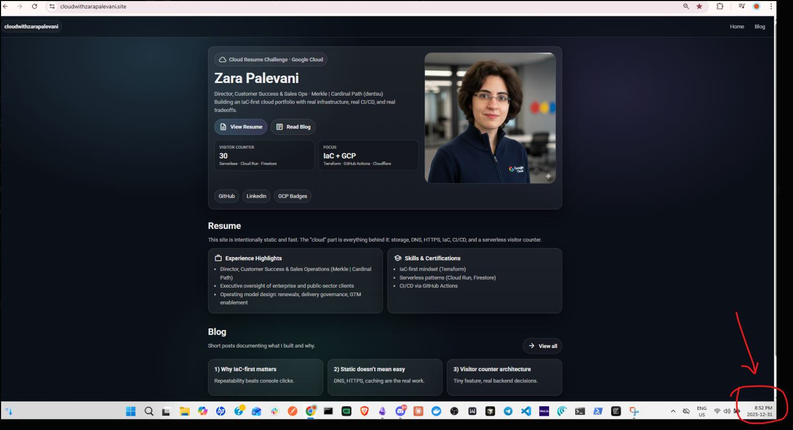

# Technical Breakdown Summary

This document provides a **clear, end-to-end technical breakdown** of the GCP Cloud Resume Challenge implementation, focusing on **what was built, how it was built, and why specific decisions were made**.

> This file intentionally complements the main `README.md`.
>
> * `README.md` explains *what the project is*
> * **Technical Breakdown Summary** explains *how and why it was executed*

---

## 1. Project Objective

The objective of this project was to design and deploy a **production-quality cloud-hosted personal site on Google Cloud Platform**, using modern infrastructure and DevOps practices:

* Static frontend hosting
* Serverless backend visitor counter
* Infrastructure as Code (IaC)
* Secure authentication
* Clear documentation and auditability

---

## 2. Development Environment

* GitHub Codespaces (Linux)
* GitHub repository as the single source of truth

**Why this mattered**

* Reproducibility
* No dependency on local machine state
* Clean separation between development and cloud execution

---

## 3. Technology Stack

### Frontend

* HTML / CSS / JavaScript
* Google Cloud Storage (static website hosting)
* Cloudflare (DNS + proxy)
* Namecheap (domain registrar)
* Google Search Console (verification & indexing)

### Backend

* Google Cloud Functions (2nd gen)
* Google API Gateway
* Firestore (visitor counter persistence)
* Artifact Registry
* Dedicated GCP service account

### Infrastructure & DevOps

* Terraform (IaC)
* Google provider
* Cloudflare provider
* Git for version control

---

## 4. Environment & Tooling Setup

Terraform was installed directly from HashiCorp’s official repository to ensure version accuracy and stability.

```bash
sudo apt-get update && sudo apt-get install -y gnupg software-properties-common
wget -O- https://apt.releases.hashicorp.com/gpg | gpg --dearmor | sudo tee /usr/share/keyrings/hashicorp-archive-keyring.gpg
sudo apt-get update
sudo apt-get install terraform
terraform --version
```

**Decision rationale**

* Avoid outdated OS packages
* Ensure predictable Terraform behavior

---

## 5. Authentication & Security

Authentication to GCP was handled using **Application Default Credentials** via environment variables.

```bash
export GOOGLE_APPLICATION_CREDENTIALS=<path-to-key>
```

**Key decisions**

* No secrets committed to Git
* Credentials managed outside Terraform
* Least-privilege service accounts

---

## 6. Frontend Deployment

Static assets were deployed to Google Cloud Storage using `gsutil rsync` for idempotent, repeatable deployments.

```bash
gsutil -m rsync -r -d GCP/site gs://cloudwithzarapalevani-site
```

Cache control headers were applied selectively when immediate refresh was required.

---

## 7. DNS & Traffic Management

* Domain nameservers delegated from Namecheap to Cloudflare
* Cloudflare used as DNS authority and proxy
* Apex domain handled via Cloudflare CNAME flattening

**Why this approach**

* Simplified DNS management
* Improved reliability
* Avoided GCS DNS limitations

---

## 8. Backend Architecture

* Cloud Functions v2 executes visitor counter logic
* API Gateway exposes a secure HTTPS endpoint
* Firestore persists and increments visit counts

**Design intent**

* Fully serverless
* Minimal operational overhead
* Clear separation of responsibilities

---

## 9. Infrastructure as Code

All infrastructure components were defined and managed using Terraform.

```bash
terraform init
terraform plan
terraform apply
```

**Principles followed**

* Terraform as source of truth
* No manual drift
* Clear variable-driven configuration

---

## 10. Version Control & Documentation

* Git commits aligned to logical milestones
* README treated as a first-class artifact
* Architecture diagram included
* Terminal history exported for auditability

```bash
history > GCP/all-terminal-history.txt
```

---

## 11. Architecture Diagram



**Diagram highlights**

* Cloudflare at the edge
* GCS serving static frontend
* API Gateway fronting Cloud Functions v2
* Firestore as the persistence layer
* IAM enforcing least privilege

---

## 12. Final Outcome

This project demonstrates:

* Practical cloud engineering skills
* Secure, serverless architecture
* Infrastructure as Code discipline
* Strong documentation and decision traceability

---

**End of Technical Breakdown Summary**
